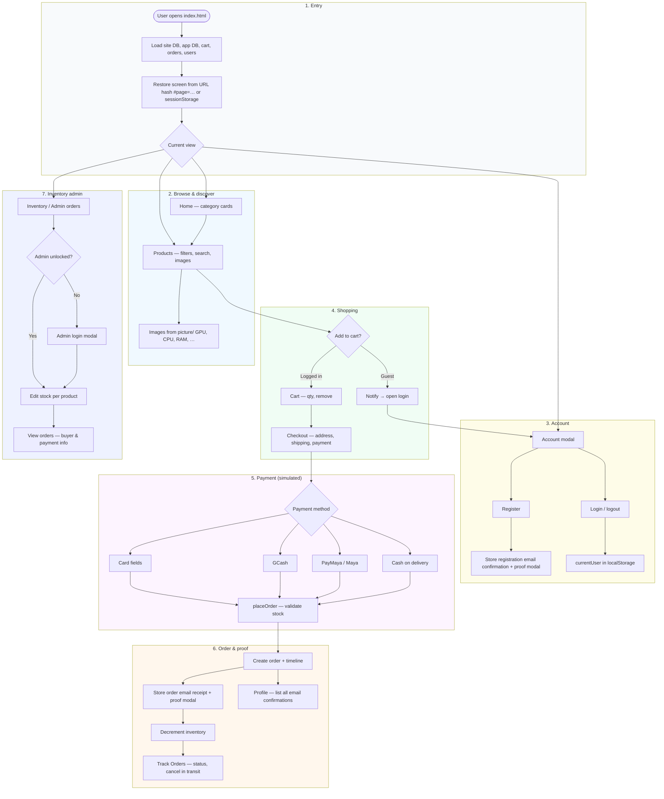
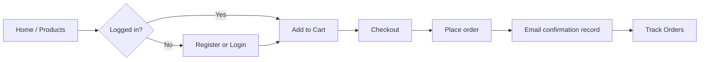

## TechParts Shopping Website

Single-page shopping site for PC components and gaming gear.  
Built with plain **HTML, CSS, and JavaScript** in one file (`index.html`), using the browser **`localStorage`** (and `sessionStorage` for the active view) for persistence. Product photos live under the `picture/` folder and are mapped to catalog items in code.

## System overview

### Simplified user journey

## Main features

- **Account**
  - Register / login modal; session in `localStorage`
  - Password reset (from login) and change password (from profile)
  - **Registration email confirmation**: full message stored as digital proof; modal shows reference ID (`MAIL-…`)
  - Profile: saved address fields, stats, **email confirmations inbox** (registration, orders, password notices)

- **Product catalog**
  - Large JS product list (GPUs, CPUs, RAM, storage, motherboards, PSUs, cases, cooling)
  - **Images** from `picture/` (with tier-based CPU photos and a few ID overrides for missing filenames)
  - Category chips and live search (search can jump to Products)

- **Cart & checkout**
  - Cart only when logged in; quantity controls and remove
  - Checkout: shipping methods, dynamic totals (shipping + tax)
  - **Payment (UI only)**: Card, **GCash**, **PayMaya**, COD
  - **Order confirmation**: receipt-style text stored + modal with reference ID; order card shows **Email confirmation ID**

- **Orders**
  - Simulated delivery timeline; cancel while in transit
  - Page persistence: **`#page=…`** in the URL and `sessionStorage` so **refresh keeps the same screen** (within auth/admin rules)

- **Inventory (admin)**
  - Separate admin login; per-product stock; stock enforced at add-to-cart and checkout
  - Admin orders list with buyer and payment summary

- **UX**
  - Toasts for quick feedback; responsive layouts and mobile nav

## Key JavaScript functions

| Area | Functions |
|------|-----------|
| Navigation | `showPage`, `persistCurrentPageInLocation`, `getPageFromLocation` |
| Auth | `registerUser`, `loginUser`, `logoutUser`, `updateAuthUI`, `resetPassword` |
| Catalog | `applyProductFilters`, `displayProducts`, `getProductImageSrc`, `getProductPictureSrc` |
| Cart | `addToCart`, `displayCart`, `increaseQty`, `decreaseQty`, `removeFromCart` |
| Checkout | `displayCheckout`, `updateShippingCost`, `updatePaymentFields`, `placeOrder` |
| Orders | `displayOrders`, `generateOrderTimeline`, `cancelOrder` |
| Email proof (demo) | `createEmailConfirmation`, `showEmailProofModal`, `buildOrderConfirmationEmailBody` |
| Admin | `loginInventoryAdmin`, `renderInventoryPage`, `renderAdminOrdersPage` |
| Persistence | `saveSiteDb`, `loadSiteDb`, `saveAppDb`, `loadAppDb`, `saveToLocalStorage`, `loadFromLocalStorage`, `saveAuthToLocalStorage`, `loadAuthFromLocalStorage` |

## Data persistence (`localStorage` / `sessionStorage`)

| Key / store | Purpose |
|-------------|---------|
| `techparts_site_db_v2` | Bundled snapshot: users, cart, orders, inventory, nested app snapshot |
| `techparts_simple_db_v1` | App DB: `sentEmails`, `profilesByEmail`, password-reset metadata |
| `cart` | Cart array (also mirrored in site DB) |
| `orders` | Orders array (also mirrored in site DB) |
| `users` | User accounts |
| `currentUser` | Active session |
| `inventoryByProductId` | Stock quantity per product id |
| `inventoryAdminUnlocked` | Admin session flag |
| `sessionStorage` `techparts_last_page` | Last SPA view (with URL `#page=…`) |

> Email “confirmations” are **not** sent over the internet; they are records in `appDb.sentEmails` for demo/school use.

## Assets

- **`picture/`** — product images organized by folder (`GPU`, `CPU`, `RAM`, `STORAGE`, `MOBO`, `PSU`, `CASE`, `COOLER`). Filename usually matches the product title (see `PICTURE_REL_PATHS` and overrides in `index.html`).

## How to run

1. Open `index.html` in a browser (or serve the folder with any static server).
2. Use **Account** to register or log in.
3. Browse **Products**, add items to **Cart**, then **Checkout** and place an order.
4. Open **Track Orders** for status; open **Profile** for saved info and **Email confirmations**.

## Screenshots (template)

Add images under `screenshots/` and adjust paths if needed.

### Desktop

### Tablet

### Mobile

### Account and checkout

## Notes

- Front-end / school-style project: **no real backend** or payment processor.
- Passwords are stored in **plain text** in `localStorage` for demo only.
- Card, GCash, PayMaya, and COD are **simulated** in the UI.
- Inventory admin credentials are constants in `index.html` (`inventoryAdminUsername` / `inventoryAdminPassword`); change them before any public deployment.
