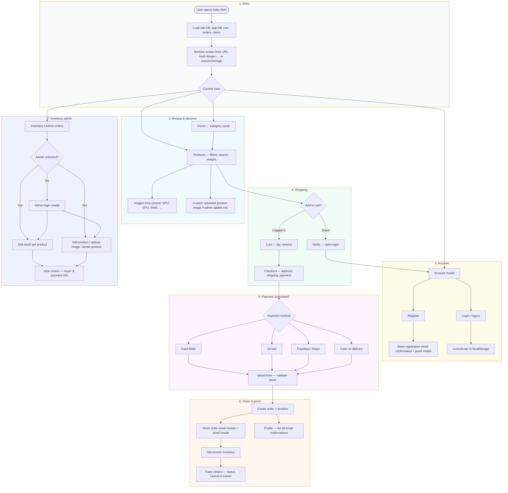
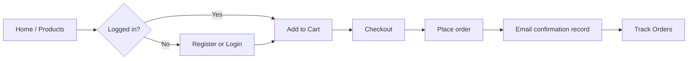

## TechParts Shopping Website

Single-page shopping site for PC components and gaming gear.  
Built with plain **HTML, CSS, and JavaScript** in one file (`index.html`), using the browser **`localStorage`** (and `sessionStorage` for the active view) for persistence. Product photos live under the `picture/` folder and are mapped to catalog items in code.

## System overview



### Simplified user journey



## Main features

- **Account**
  - Register / login modal; session in `localStorage`
  - Password reset (from login) and change password (from profile)
  - **Registration email confirmation**: full message stored as digital proof; modal shows reference ID (`MAIL-…`)
  - Profile: saved address fields, stats, **email confirmations inbox** (registration, orders, password notices)

- **Product catalog**
  - Large JS product list (GPUs, CPUs, RAM, storage, motherboards, PSUs, cases, cooling)
  - **Images** from `picture/` or from admin-uploaded image data stored in `localStorage`
  - Category chips and live search (search can jump to Products)

- **Cart & checkout**
  - Cart only when logged in; quantity controls and remove
  - Checkout: shipping methods, dynamic totals (shipping + tax)
  - **Payment (UI only)**: Card, **GCash**, **PayMaya**, COD
  - **Order confirmation**: receipt-style text stored + modal with reference ID; order card shows **Email confirmation ID**

- **Orders**
  - Delivery timeline: **automatic** (time-based) or **manual** stages set in Admin Orders (see **Algorithm A4 / A5** in README)
  - Cancel while in transit; page persistence via **`#page=…`** and `sessionStorage`

- **Inventory (admin)**
  - Separate admin login; per-product stock; stock enforced at add-to-cart and checkout
  - Admin-only product add/delete with optional uploaded product image
  - Admin orders: buyers, payments, and **tracking stage** dropdown (customer-visible on Track Orders)

- **UX**
  - Toasts for quick feedback; responsive layouts and mobile nav

## Algorithms

The behaviors below are implemented in `index.html` (plain JavaScript). Pseudocode is simplified for documentation.

### A1. Restore SPA view after load or refresh

**Goal:** Keep the user on the same screen when they refresh (e.g. Products, Checkout).

```
INPUT: location.hash, sessionStorage['techparts_last_page']
OUTPUT: valid page id ∈ { home, products, cart, checkout, inventory, admin-orders, profile, tracking }

1. Parse hash: match pattern "page=<id>" (case-insensitive id).
2. If id is in KNOWN_PAGE_IDS → return id.
3. Else read sessionStorage 'techparts_last_page'; if valid id → return it.
4. Else return 'home'.

On every successful showPage(pageName):
5. sessionStorage.setItem('techparts_last_page', pageName).
6. If location.hash ≠ '#page=' + pageName → history.replaceState(null, '', '#page=' + pageName).

On hashchange event:
7. If parsed page ≠ currentPage → showPage(parsed page).
```

---

### A2. Product list filtering (category + search)

**Goal:** Show only products that match the selected category and optional search text.

```
INPUT: products[], selectedCategory, searchQuery (lowercased, trimmed)
OUTPUT: filtered list for displayProducts()

For each product p:
1. categoryOk ← (selectedCategory = 'All') OR (p.category = selectedCategory).
2. If searchQuery is empty → queryOk ← true.
   Else queryOk ← p.name, p.description, p.category, or any p.specs[] contains searchQuery.
3. Include p iff categoryOk AND queryOk.
```

---

### A3. Product image URL resolution

**Goal:** Resolve a product image from admin upload, bundled `picture/` assets, or a generated SVG thumbnail.

```
INPUT: product { id, name, category }
OUTPUT: image URL string

1. If customProductImagesById[product.id] exists → return that stored data URL.
2. If PRODUCT_PICTURE_OVERRIDE_BY_ID[product.id] exists:
     Resolve path via PICTURE_LOOKUP (case-insensitive folder/file key) → return 'picture/' + encoded segments.
3. folder ← CATEGORY_TO_PICTURE_FOLDER[product.category] (e.g. GPUs → GPU).
4. If category = 'Processors':
     base ← resolveProcessorPictureBasename(name)  // Threadripper → AMD Threaripper file, i5 → intel i5, etc.
     Try base + '.jpg' then '.png' in PICTURE_LOOKUP → return URL if found.
5. Else try product.name + '.jpg' then '.png' in folder via PICTURE_LOOKUP.
6. If no file → return getProductThumbnailDataUri(product) (SVG data URI with initials).
```

**Picture index:** `PICTURE_REL_PATHS` is normalized into `PICTURE_LOOKUP[lowercase(folder + '/' + filename)] → canonical relative path`.

---

### A4. Order tracking progress (customer timeline)

**Goal:** Decide which timeline steps (0…4) appear completed: admin override beats time-based simulation.

```
INPUT: order { status, adminTrackingStep?, timeline[0..4].date, date }
OUTPUT: stepIndex ∈ { -1, 0, 1, 2, 3, 4 }  (-1 = cancelled / invalid)

getEffectiveTrackingStep(order):
1. If order.status = 'cancelled' → return -1.
2. If adminTrackingStep is integer in [0, 4] → return adminTrackingStep.
3. Else return simulateDeliveryStatus(order).

simulateDeliveryStatus(order):
4. now ← current time.
5. For i from 0 to 4:
     If now < timeline[i].date → return max(0, i - 1).
6. Return 4 (all steps passed by time).

UI: Step k is "completed" iff k ≤ getEffectiveTrackingStep(order) (for non-cancelled orders).
```

---

### A5. Admin update tracking

**Goal:** Persist a manual stage so customers see processing / shipped / delivery on Track Orders.

```
INPUT: orderId, value from <select> ('' or '0'..'4')
PRE: inventory admin session unlocked

1. Find order by id; if missing or cancelled → stop.
2. If value is empty:
     Delete order.adminTrackingStep and order.trackingUpdatedAt.
   Else:
     Parse integer step; if not in [0, 4] → stop.
     order.adminTrackingStep ← step; order.trackingUpdatedAt ← ISO now.
3. saveToLocalStorage() (orders + site DB); re-render admin orders list.
```

---

### A6. Place order (checkout)

**Goal:** Validate address, payment, stock; create order; record proof email; decrement inventory.

```
INPUT: checkout form, cart[], inventoryByProductId, shippingCost
OUTPUT: order appended; cart cleared; localStorage updated

1. Validate required shipping fields; if any missing → alert and stop.
2. Validate payment fields by method (card / GCash / PayMaya / COD); build paymentDetails and paymentStatus.
3. For each cart line: if quantity > getProductStockQty(productId) → alert, go to cart, stop.
4. Build order: id ← 'ORD-' + timestamp, items, shippingAddress, totals, timeline ← generateOrderTimeline(shippingMethod), status ← 'processing'.
5. body ← buildOrderConfirmationEmailBody(order, paymentLabel).
6. checkoutEmail ← createEmailConfirmation('checkout', email, subject, body, { relatedOrderId }).
7. order.proofEmailId ← checkoutEmail.id.
8. Push order to orders[].
9. For each cart line: inventoryByProductId[id] ← max(0, currentQty - quantity).
10. saveInventoryDatabase(); saveToLocalStorage(); clear cart; show proof modal; show tracking page.
```

---

### A7. Add to cart

**Goal:** Only logged-in users; respect stock and per-line cap.

```
INPUT: productId, currentUser, cart[], inventory

1. If no currentUser → notify, open login, stop.
2. available ← getProductStockQty(productId); if available ≤ 0 → notify out of stock, stop.
3. If line exists: if currentQty + 1 > available → notify only N left, stop; else increment quantity.
4. Else push new line { id, name, price, quantity: 1 }.
5. saveToLocalStorage(); update cart badge; notify success.
```

---

### A8. Email confirmation record (demo mailbox)

**Goal:** Append an immutable-style log entry for registration, checkout, password events.

```
INPUT: type, toEmail, subject, body, optional { relatedOrderId }
OUTPUT: emailRecord { id, type, to, subject, body, sentAt, relatedOrderId? }

1. id ← 'MAIL-' + timestamp + random suffix.
2. Append record to appDb.sentEmails; saveAppDb().
3. Return record (for proof modals and order.proofEmailId).
```

---

### A9. Cancel order (customer)

**Goal:** Mark cancelled and restore stock.

```
INPUT: orderIndex, orders[]

1. Confirm with user.
2. order.status ← 'cancelled'.
3. For each line item: inventoryByProductId[id] += quantity.
4. saveInventoryDatabase(); saveToLocalStorage(); refresh tracking UI.
```

---

### A10. Admin add product to inventory

**Goal:** Only unlocked inventory admin can create a product, set stock, and optionally attach an uploaded image.

```
INPUT: inventory form fields, optional image file
PRE: inventory admin session unlocked
OUTPUT: product added to catalog; inventory and localStorage updated

1. If admin is not unlocked → notify, open admin login modal, stop.
2. Validate required fields: name, category, description, positive price.
3. nextId ← max(products[].id) + 1.
4. Build product object { id, name, category, description, icon, specs[], price, oldPrice: null, badge? }.
5. Append product to products[] and customProducts[].
6. setProductStockQty(product.id, initialStock).
7. If no image file:
     saveProductCatalogDatabase(); clear form; refresh inventory + product grid; notify success.
8. Else read file with FileReader.readAsDataURL(...).
9. On success: customProductImagesById[product.id] ← data URL.
10. saveProductCatalogDatabase(); clear form; refresh inventory + product grid; notify success.
```

---

### A11. Admin delete product from inventory

**Goal:** Only unlocked inventory admin can remove a product and persist that deletion.

```
INPUT: productId
PRE: inventory admin session unlocked
OUTPUT: product removed from visible catalog; persistence updated

1. If admin is not unlocked → notify, open admin login modal, stop.
2. Find product by id; if missing → stop.
3. Ask for confirmation; if cancelled → stop.
4. Remove product from products[].
5. Remove product from customProducts[].
6. If productId not already in deletedProductIds[] → append it.
7. Delete customProductImagesById[productId].
8. Delete inventoryByProductId[productId].
9. saveInventoryDatabase(); saveProductCatalogDatabase(); refresh inventory + product grid.
```

## Key JavaScript functions

| Area | Functions |
|------|-----------|
| Navigation | `showPage`, `persistCurrentPageInLocation`, `getPageFromLocation` |
| Auth | `registerUser`, `loginUser`, `logoutUser`, `updateAuthUI`, `resetPassword` |
| Catalog | `applyProductFilters`, `displayProducts`, `getProductImageSrc`, `getProductPictureSrc` |
| Cart | `addToCart`, `displayCart`, `increaseQty`, `decreaseQty`, `removeFromCart` |
| Checkout | `displayCheckout`, `updateShippingCost`, `updatePaymentFields`, `placeOrder` |
| Orders | `displayOrders`, `generateOrderTimeline`, `cancelOrder` |
| Email proof (demo) | `createEmailConfirmation`, `showEmailProofModal`, `buildOrderConfirmationEmailBody` |
| Admin | `loginInventoryAdmin`, `renderInventoryPage`, `renderAdminOrdersPage`, `addInventoryProduct`, `deleteInventoryProduct`, `updateInventoryQty` |
| Persistence | `saveSiteDb`, `loadSiteDb`, `saveAppDb`, `loadAppDb`, `saveToLocalStorage`, `loadFromLocalStorage`, `saveAuthToLocalStorage`, `loadAuthFromLocalStorage` |

## Data persistence (`localStorage` / `sessionStorage`)

| Key / store | Purpose |
|-------------|---------|
| `techparts_site_db_v2` | Bundled snapshot: users, cart, orders, inventory, custom products, deleted product ids, uploaded image map, nested app snapshot |
| `techparts_simple_db_v1` | App DB: `sentEmails`, `profilesByEmail`, password-reset metadata |
| `cart` | Cart array (also mirrored in site DB) |
| `orders` | Orders array (also mirrored in site DB) |
| `users` | User accounts |
| `currentUser` | Active session |
| `inventoryByProductId` | Stock quantity per product id |
| `inventoryAdminUnlocked` | Admin session flag |
| `inventoryCustomProducts` | Admin-added products persisted outside the base hardcoded catalog |
| `inventoryDeletedProductIds` | Product ids hidden/removed by admin |
| `inventoryCustomProductImagesById` | Uploaded product image data URLs keyed by product id |
| `sessionStorage` `techparts_last_page` | Last SPA view (with URL `#page=…`) |

> Email “confirmations” are **not** sent over the internet; they are records in `appDb.sentEmails` for demo/school use.

## Assets

- **`picture/`** — product images organized by folder (`GPU`, `CPU`, `RAM`, `STORAGE`, `MOBO`, `PSU`, `CASE`, `COOLER`). Filename usually matches the product title (see `PICTURE_REL_PATHS` and overrides in `index.html`).

## How to run

1. Open `index.html` in a browser (or serve the folder with any static server).
2. Use **Account** to register or log in.
3. Browse **Products**, add items to **Cart**, then **Checkout** and place an order.
4. Open **Track Orders** for status; open **Profile** for saved info and **Email confirmations**.

## Screenshots (template)

Add images under `screenshots/` and adjust paths if needed.

### Desktop


### Tablet


### Mobile


### Account and checkout


## Notes

- Front-end / school-style project: **no real backend** or payment processor.
- Passwords are stored in **plain text** in `localStorage` for demo only.
- Card, GCash, PayMaya, and COD are **simulated** in the UI.
- Inventory admin credentials are constants in `index.html` (`inventoryAdminUsername` / `inventoryAdminPassword`); change them before any public deployment.
